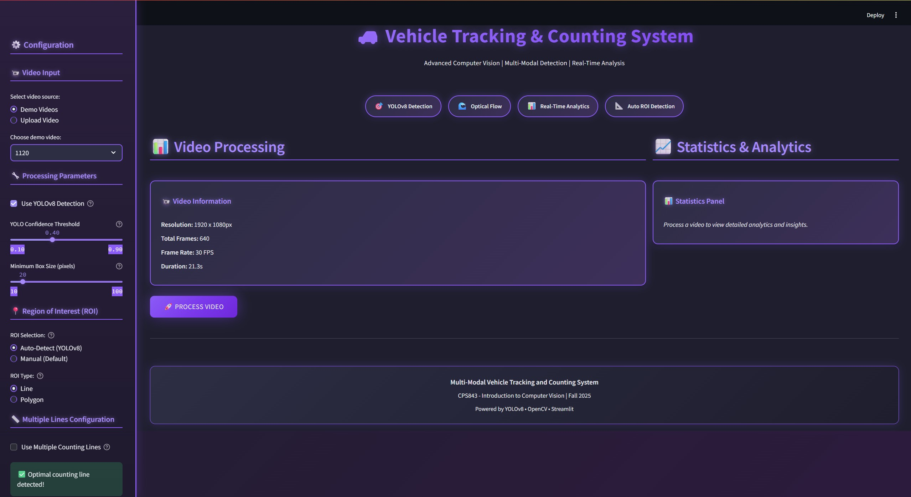
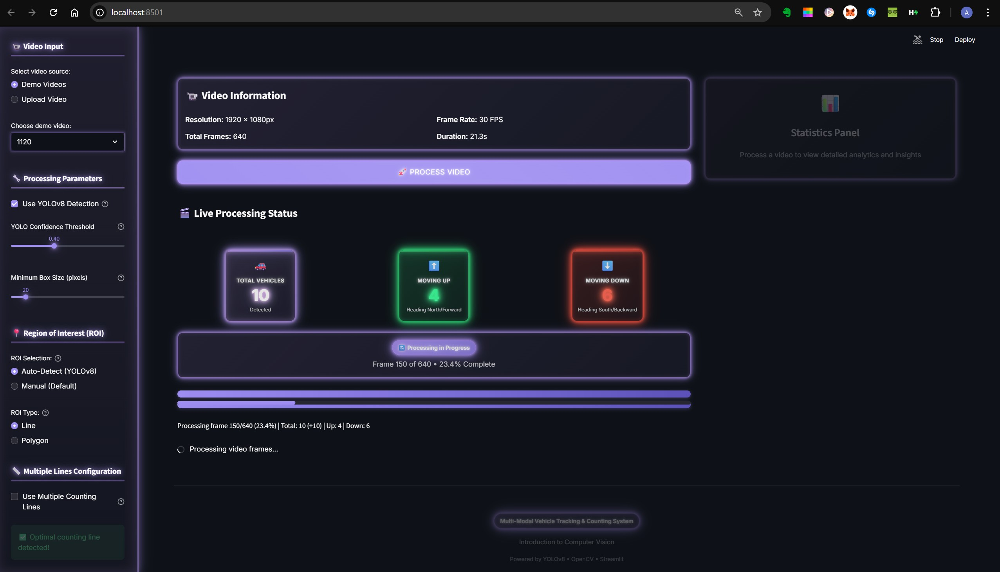
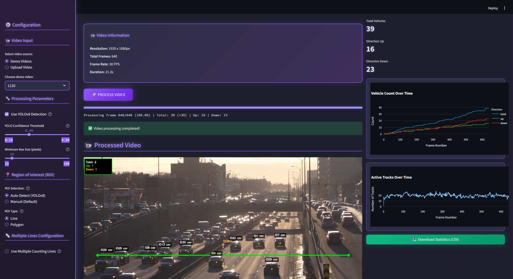
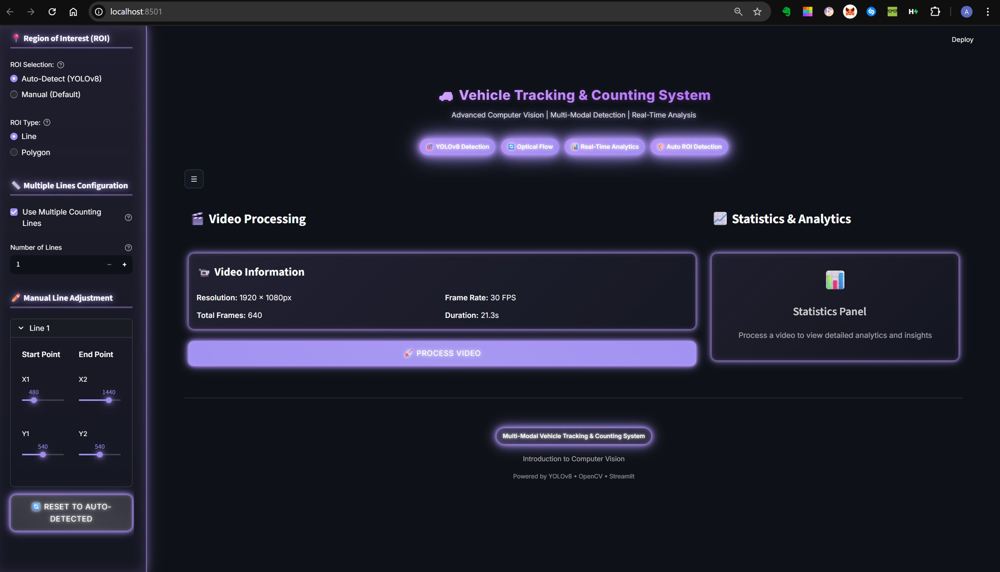

# Real-Time Vehicle Tracking & Counting System


A comprehensive real-time vehicle tracking and counting system that combines **optical flow** and **YOLOv8 deep learning** detection for accurate vehicle tracking and counting. Features a modern web-based interface built with Streamlit for easy video processing and analysis.

Developed as part of **CPS843 - Introduction to Computer Vision** at Toronto Metropolitan University.

---

## 🎯 What It Does

This application tracks and counts vehicles in video footage using advanced computer vision techniques. It can:

- **Detect vehicles** using either optical flow (Lucas-Kanade) or YOLOv8 deep learning
- **Track vehicles** across frames with persistent track IDs
- **Count vehicles** as they cross user-defined regions of interest (ROI)
- **Visualize results** with annotated videos showing track IDs and trajectories
- **Provide statistics** including total counts, directional counts, and real-time analytics

---

## 📸 Application Interface

### Main Dashboard



The web interface provides an intuitive dashboard with:
- **Video Input Selection**: Choose from demo videos or upload your own MP4/MOV files
- **Processing Parameters**: Adjust YOLO confidence threshold, minimum box size, and detection methods
- **ROI Configuration**: Set up counting lines or polygons with auto-detection support
- **Real-Time Statistics**: View vehicle counts, directional statistics, and processing progress

### Processing Interface



The system processes videos in chunks, providing real-time feedback and progress updates. You can adjust confidence thresholds to balance between detection accuracy and false positive rates.

### Results Visualization



Processed videos show:
- **Track IDs**: Each vehicle is assigned a unique ID (e.g., ID0, ID1, ID2)
- **Trajectory Paths**: Visual trails showing vehicle movement
- **Bounding Boxes**: Detection boxes around each vehicle
- **Counting Lines**: Visual representation of ROI boundaries

### Multiple Line Configuration



Advanced users can configure multiple counting lines for enhanced accuracy and validation. Each vehicle is counted only once, even when crossing multiple lines.

---

## ✨ Key Features

- **Dual Detection Methods**: 
  - Optical Flow (Lucas-Kanade) for fast, efficient tracking
  - YOLOv8 deep learning for high-accuracy detection
  
- **Automatic ROI Detection**: Uses YOLOv8 to analyze vehicle movement and suggest optimal counting lines

- **Persistent Track IDs**: Each vehicle maintains a unique ID throughout the video, preventing double-counting

- **Chunk-Based Processing**: Processes videos in frames for faster analysis and real-time feedback

- **Flexible ROI Types**: 
  - Line ROI: Count vehicles crossing a line
  - Polygon ROI: Count vehicles entering/exiting a region

- **Real-Time Analytics**: Live statistics showing total counts, directional counts, and processing progress

- **Web-Based Interface**: Easy-to-use Streamlit dashboard with drag-and-drop video upload

---

## 🚀 Quick Start

### 1. Installation

```bash
cd Project
pip install -r requirements.txt
```

### 2. Run the Web Interface

```bash
streamlit run app.py
```

The application will open in your browser at `http://localhost:8501`

### 3. Process a Video

1. Select a demo video or upload your own MP4/MOV file
2. Choose detection method (YOLOv8 recommended for accuracy)
3. Adjust confidence threshold (0.4 recommended for best balance)
4. Set up ROI (use auto-detect or draw manually)
5. Click "PROCESS VIDEO" and wait for results

---

## 🔧 How It Works

### Optical Flow Tracking
Uses Lucas-Kanade sparse optical flow to track feature points across frames. Detects "good features to track" using Shi-Tomasi corner detection and tracks them frame-to-frame. Fast and efficient, achieving 60+ FPS on CPU.

### YOLOv8 Detection
Deep learning-based object detection using YOLOv8 model. Provides superior accuracy (90-95% at confidence threshold 0.4) by detecting vehicles as complete objects rather than tracking features. Operates at 10-15 FPS on CPU.

### Kalman Filtering
Smooths trajectories and predicts positions during brief occlusions using a constant velocity model. Helps maintain track continuity even when vehicles are temporarily hidden.

### ROI-Based Counting
Counts vehicles when their track IDs cross defined boundaries (lines or polygons). Each track ID can only trigger one count, preventing double-counting.

---

## 📊 Performance

- **Accuracy**: 90-95% vehicle counting accuracy at confidence threshold 0.4
- **Speed**: 
  - YOLOv8: 10-15 FPS on CPU
  - Optical Flow: 60+ FPS on CPU
- **Detection Classes**: Car, Motorcycle, Bus, Truck (from COCO dataset)

---

## 🛠️ Tech Stack

| Technology | Purpose |
|------------|---------|
| **OpenCV** | Video processing, optical flow, visualization |
| **YOLOv8** (Ultralytics) | Deep learning-based vehicle detection |
| **Streamlit** | Web-based user interface |
| **FilterPy** | Kalman filter implementation |
| **NumPy/SciPy** | Numerical computations |
| **Plotly** | Interactive charts and statistics |

---

## 📁 Project Structure

```
real-time-vehicle-tracking-cv/
├── Project/                    # Main application
│   ├── app.py                  # Streamlit web interface
│   ├── main.py                 # Command-line interface
│   ├── src/                    # Core modules
│   │   ├── video_processor.py
│   │   ├── optical_flow_tracker.py
│   │   ├── yolo_detector.py
│   │   ├── vehicle_counter.py
│   │   └── utils.py
│   ├── data/                   # Sample videos
│   └── output/                 # Processed videos
└── README.md                   # This file
```

---

## 👥 Author

**Arshia Rahim**  
Computer Engineering (Software) @ Toronto Metropolitan University  
GitHub: [@ArshiaRx](https://github.com/ArshiaRx)

**Collaborators**: Ansugan Subramaniam, Wajeehul Hassan

---

## 📚 Course Information

**CPS843 - Introduction to Computer Vision**  
Fall 2025 • Toronto Metropolitan University

---

## 🔗 Repository

**GitHub**: [https://github.com/ArshiaRx/real-time-vehicle-tracking-cv.git](https://github.com/ArshiaRx/real-time-vehicle-tracking-cv.git)

---

## 📖 Documentation

For detailed technical documentation, usage examples, and configuration options, see [`Project/README.md`](Project/README.md).

---

## 📄 License

Educational project. Feel free to reference with attribution.
